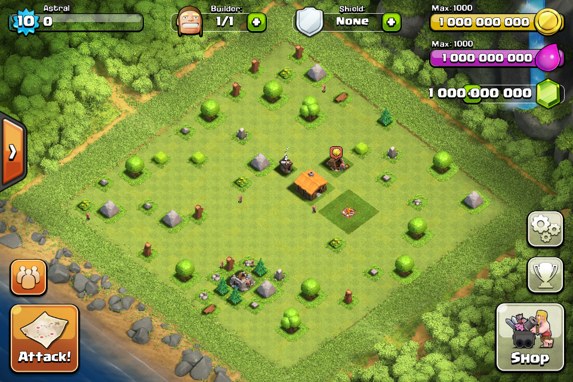

# CoC 1.70
Open source private server emulator for Clash of Clans 1.70 (2012) written in Node.js

## Requirements
* [Node.js](https://nodejs.org)

## Setup
1. Download the repository by zip or type this into the Terminal: `git clone https://github.com/astralsc/CoC-1.70.git`
2. Go into Command Prompt or Terminal and type `npm install` to build the server.
3. Go into Command Prompt or Terminal and type `node .` to start the server.
4. Now it is finished and you can use my client linked in the releases to connect to your server.

## Why does the game have like half the features not working?
This repository is only for testing purposes or you can take the packet structures and make a whole new server, you need to implement all the packets and logic yourself.

## Credits
Core created by [tailsjs](https://github.com/tailsjs/nodebrawl-core)   

